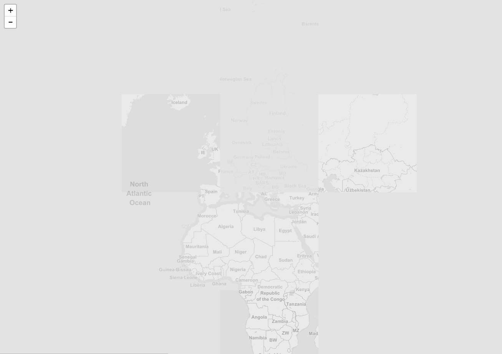

## leaflet-geopackage &mdash; Load GeoPackage layers in Leaflet

Load GeoPackage tile and feature layers in the browser without a server.  When a layer is added to the map, the GeoPackage will be downloaded and then the specified layer will be loaded on the map.

### Demo

[Sample Page](https://ngageoint.github.io/leaflet/index.html) which loads a tile layer and a feature layer from the [Natural Earth Rivers GeoPackage](http://ngageoint.github.io/GeoPackage/examples/rivers.gpkg)

Loading a feature layer:  


### Usage

```js
// Load the Rivers GeoPackage and display the tile layer
L.geoPackageTileLayer({
    geoPackageUrl: 'http://ngageoint.github.io/GeoPackage/examples/rivers.gpkg',
    layerName: 'rivers_tiles'
}).addTo(map);

// Load the Rivers GeoPackage and display the feature layer
L.geoPackageFeatureLayer([], {
    geoPackageUrl: 'http://ngageoint.github.io/GeoPackage/examples/rivers.gpkg',
    layerName: 'rivers'
}).addTo(map);
```

### GeoPackageTileLayer Options

GeoPackageTileLayer extends L.GridLayer and accepts all options for L.GridLayer in addition to the following:

| option       | type    |  |
| ------------ | ------- | -------------- |
| `geoPackageUrl`     | String  | The URL to the GeoPackage
| `layerName`   | String  | Name of the Tile Layer within the GeoPackage
| `noCache`   | Boolean  | defaults to true set false to re-download the GeoPackage even if a previous layer has already downloaded it

### GeoPackageFeatureLayer Options

GeoPackageFeatureLayer extends L.GeoJSON and accepts all options for L.GeoJSON in addition to the following:

| option       | type    | |
| ------------ | ------- | -------------- |
| `geoPackageUrl`     | String  | The URL to the GeoPackage
| `layerName`   | String  | Name of the Feature Layer within the GeoPackage
| `noCache`   | Boolean  | defaults to true set false to re-download the GeoPackage even if a previous layer has already downloaded it

### Browser builds

```bash
npm install
npm run build-dev # development build, used by the debug page
npm run build-min # minified production build
```

### Changelog

##### 2.0.0

- **Breaking**: Moved TileLayer from L.GridLayer.GeoPackage to L.GeoPackageTileLayer
- Added L.GeoPackageFeatureLayer

##### 1.0.0

- Initial release.
